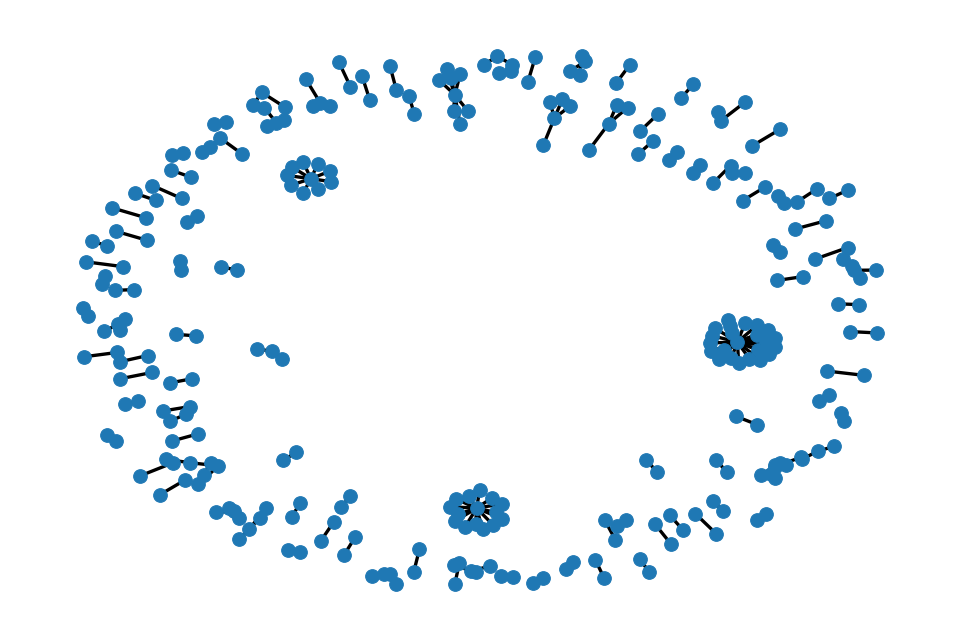

# Sayari Data Task

Repository created for the completion of the Sayari Data Task.

The repository has been structed in the form of a Scrapy project with Sayari_data_task/ND_businesses as the directory. 
To generate the scraped data with a scrapy project, run `scrapy crawl ND_businesses -O ND_businesses.json` which will store the scraped data in the ND_businesses.json file. Running just the spider itself will not produce an output. After the data has been stored in the json file, network_graph.py can then be run to generate a png of the network graph. The nework graph as of 11/7/2024 is below.

 
